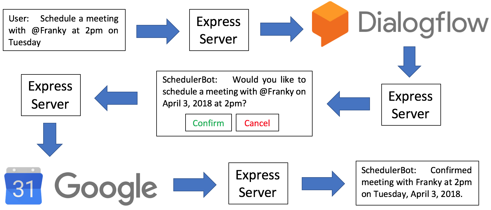

# Slack-Scheduler-Bot
A Slackbot to help you set up reminders and schedule Google Calendar events with other team members.

## Objectives
1. Set reminders
2. Schedule meetings


## Data Flow
1. User sends a direct message to SchedulerBot:
   - Samples: `Schedule a meeting with @Franky at 2pm next Tuesday`, `Remind me to buy grocery tomorrow`
   - **For first-time users**:
      - SchedulerBot provides a URL for user to authorize access to user's Google Calendar
2. SchedulerBot sends user's message to Dialogflow via an express server hosted on Heroku
3. Dialogflow analyzes the message and returns a JSON object of parsed information
```
{
...
"result": {
  ...
  "action": "set_meeting",
  "actionIncomplete": false,
  "parameters": {
    "start_time": "14:00:00",
    "invitees": [ "Brian", "Franky" ],
    "date": "2018-04-03",
    "subject": "Weekly Seminar",
    ...
    }
...
}
```
4. Express server tells SchedulerBot to prompt user for confirmation of the new meeting/reminder based on returned intent & parameters
5. User can either confirm or cancel
6. (**If user confirms**) SchedulerBot signals the express server to go ahead with the request
7. Express server uses Calendar API to create new reminder/meeting on user's Google Calendar
8. SchedulerBot sends user a message when the new reminder/meeting is successfully created.



## API References
- [Slack API](https://api.slack.com/)
  - Incoming Webhooks
  - Interactive Components
  - Real Time Messaging (RTM)
  - Web APIs
- [Google Calendar API](https://developers.google.com/calendar/v3/reference/)
- [Dialogflow](https://dialogflow.com/docs/getting-started/basics) (formerly API.AI)
